# ggtte

The **ggtte** package was developed to extend **ggplot2** to more flexibly create graphics for time-to-event analyses. In contrast to other **R** packages, **ggtte** preserves the familiar **ggplot2** style API with tidy data.

# Motivation

Let's look at a simple example using the `colon` dataset included in the **survival** package. This dataset contains survival data for patients with stage B/C colon cancer from a well-known trial of adjuvant chemotherapy. Patients were randomized to receive one of three treatment conditions:  

- Observation (no treatment);  
- Levamisole; and  
- Levamisole + 5FU.  


Suppose we're interested in the relationship between the treatment strategies and time to death. One approach to this question is to perform a Kaplan-Meier analysis, plotting a survival curve for each intervention.

To do this using the **survival** package and base **R** we would do the following:


```r

# copy data from survival package
df <- survival::colon

# clean up data, label factors
df <- df %>%
  mutate(
    sex = factor(sex, levels = c(0, 1), labels = c("Female", "Male")),
    differ = factor(differ, levels = c(1, 2, 3), labels = c("Well", "Moderate", "Poor")),
    node4 = factor(node4, levels = c(0, 1), labels = c("\u22644", ">4")),
    etype = factor(etype, levels = c(1, 2), labels = c("Recurrence", "Death"))
  )

# estimate overall survival curves by treatment group
fit1 <- survfit(formula = Surv(time = time, event = status) ~ rx, data = df %>% filter(etype == "Death"))

# plot the curves
plot(fit1)
```
[image 1](man/readme-figures/unnamed-chunk-1-1.png)


We might also be interested in the number of individuals at risk and the number of events at specific follow-up timepoints:


```r
# get information about survival curves at specific timepoints
summary(fit1, times = seq(0, 1500, by = 500))
#> Call: survfit(formula = Surv(time = time, event = status) ~ rx, data = df %>% 
#>     filter(etype == "Death"))
#> 
#>                 rx=Obs 
#>  time n.risk n.event survival std.err lower 95% CI upper 95% CI
#>     0    315       0    1.000  0.0000        1.000        1.000
#>   500    267      47    0.851  0.0201        0.812        0.891
#>  1000    211      56    0.672  0.0265        0.622        0.726
#>  1500    176      35    0.561  0.0280        0.508        0.618
#> 
#>                 rx=Lev 
#>  time n.risk n.event survival std.err lower 95% CI upper 95% CI
#>     0    310       0    1.000  0.0000        1.000        1.000
#>   500    265      45    0.855  0.0200        0.817        0.895
#>  1000    203      62    0.655  0.0270        0.604        0.710
#>  1500    173      30    0.558  0.0282        0.505        0.616
#> 
#>                 rx=Lev+5FU 
#>  time n.risk n.event survival std.err lower 95% CI upper 95% CI
#>     0    304       0    1.000  0.0000        1.000        1.000
#>   500    267      37    0.878  0.0188        0.842        0.916
#>  1000    227      40    0.747  0.0249        0.699        0.797
#>  1500    203      21    0.677  0.0268        0.627        0.732
```

As is clearly evident, this output is not the most visually compelling way to portray the results. Luckily, we can leverage the extreme flexibility afforded by **ggplot2** by using the **survminer** package to plot Kaplan-Meier curves:


```r
ggsurvplot(
  fit = fit1,
  censor = FALSE
)
```

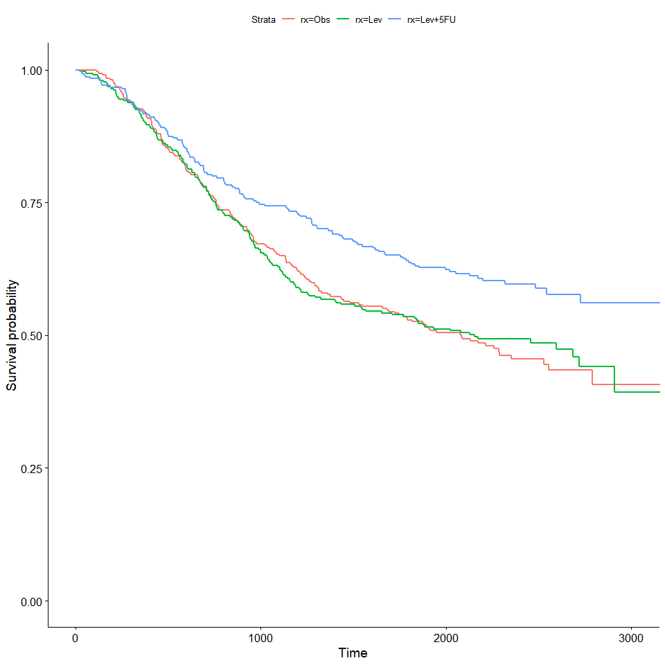

The **survminer** package also allows us to add a table with the number at risk, number of events/censored observations, and cumulative number of events/censored observations at specific timepoints:


```r
ggsurvplot(
  fit = fit1,
  censor = FALSE,
  risk.table = TRUE
)
```

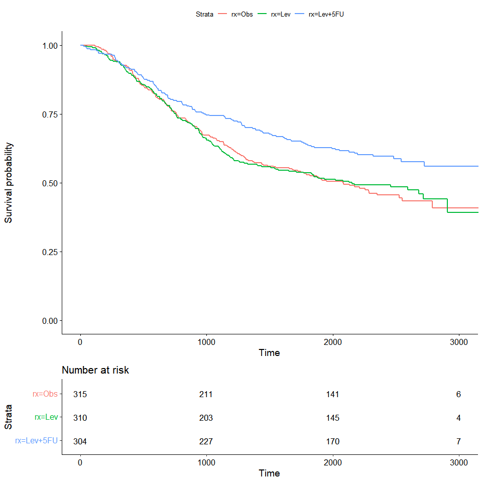


Suppose that we're interested in evaluating not just recurrence-free survival but also overall survival in each study arm. To do this with the `survival` package and base `R`, we could do the following:


```r
fit2 <- survfit(Surv(time, status) ~ rx + etype, data = df)

plot(fit2)
```

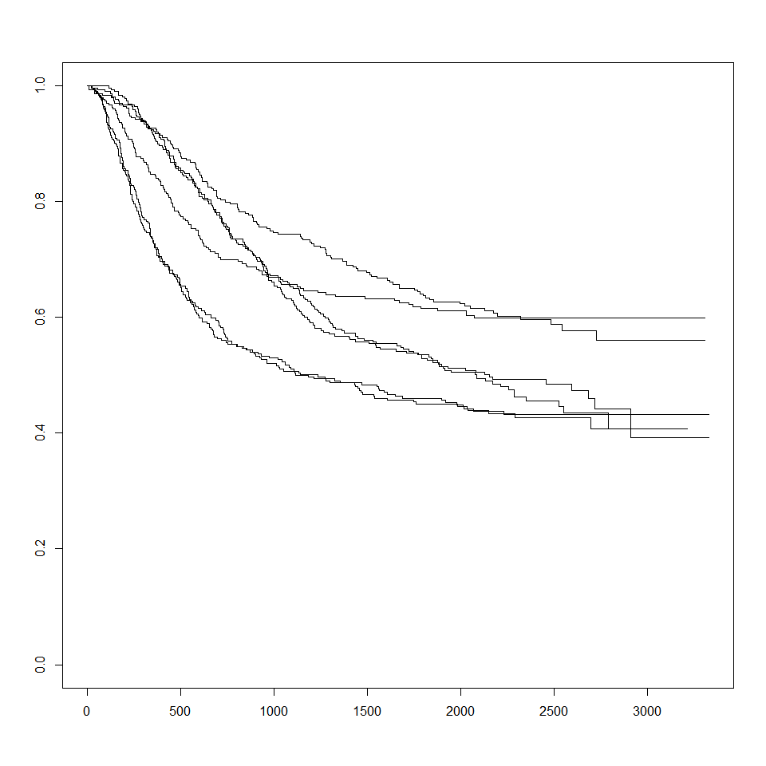

```r

summary(fit2, times = seq(0, 1500, by = 500))
#> Call: survfit(formula = Surv(time, status) ~ rx + etype, data = df)
#> 
#>                 rx=Obs, etype=Recurrence 
#>  time n.risk n.event survival std.err lower 95% CI upper 95% CI
#>     0    315       0    1.000  0.0000        1.000        1.000
#>   500    203     109    0.654  0.0268        0.603        0.708
#>  1000    161      38    0.530  0.0283        0.478        0.589
#>  1500    139      19    0.467  0.0284        0.415        0.526
#> 
#>                 rx=Obs, etype=Death      
#>  time n.risk n.event survival std.err lower 95% CI upper 95% CI
#>     0    315       0    1.000  0.0000        1.000        1.000
#>   500    267      47    0.851  0.0201        0.812        0.891
#>  1000    211      56    0.672  0.0265        0.622        0.726
#>  1500    176      35    0.561  0.0280        0.508        0.618
#> 
#>                 rx=Lev, etype=Recurrence 
#>  time n.risk n.event survival std.err lower 95% CI upper 95% CI
#>     0    310       0    1.000  0.0000        1.000        1.000
#>   500    199     107    0.652  0.0272        0.601        0.707
#>  1000    157      40    0.520  0.0286        0.467        0.579
#>  1500    145      11    0.484  0.0286        0.431        0.543
#> 
#>                 rx=Lev, etype=Death      
#>  time n.risk n.event survival std.err lower 95% CI upper 95% CI
#>     0    310       0    1.000  0.0000        1.000        1.000
#>   500    265      45    0.855  0.0200        0.817        0.895
#>  1000    203      62    0.655  0.0270        0.604        0.710
#>  1500    173      30    0.558  0.0282        0.505        0.616
#> 
#>                 rx=Lev+5FU, etype=Recurrence 
#>  time n.risk n.event survival std.err lower 95% CI upper 95% CI
#>     0    304       0    1.000  0.0000        1.000        1.000
#>   500    231      68    0.774  0.0241        0.728        0.823
#>  1000    198      31    0.670  0.0272        0.619        0.725
#>  1500    184      11    0.633  0.0279        0.580        0.690
#> 
#>                 rx=Lev+5FU, etype=Death      
#>  time n.risk n.event survival std.err lower 95% CI upper 95% CI
#>     0    304       0    1.000  0.0000        1.000        1.000
#>   500    267      37    0.878  0.0188        0.842        0.916
#>  1000    227      40    0.747  0.0249        0.699        0.797
#>  1500    203      21    0.677  0.0268        0.627        0.732
```

Or with **survminer**:


```r
ggsurvplot(
  fit = fit2,
  censor = FALSE,
  risk.table = TRUE
  )
```

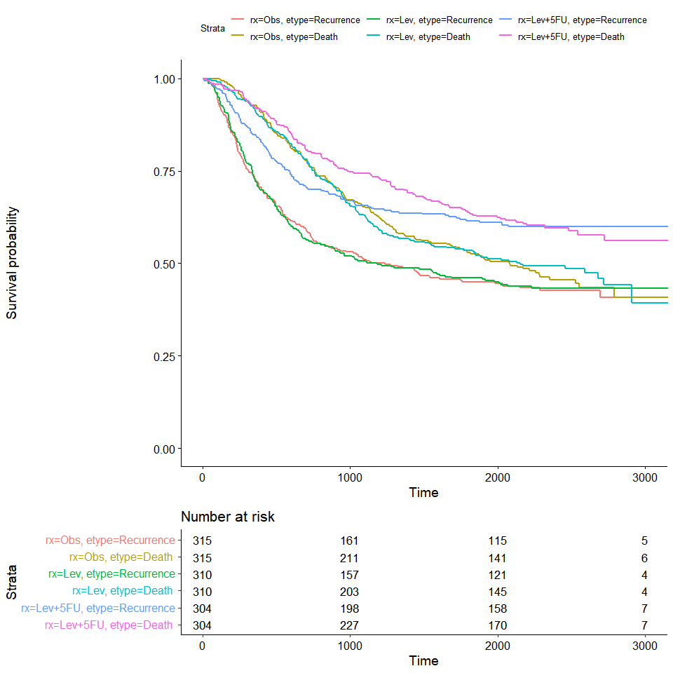

Neither of these outputs are very appealing - things are getting way too crowded! We can solve a portion of this problem by plotting each set of survival curves in separate panels according to differentiation type. **survminer** does this by taking advantage of **ggplot2** facets:


```r
ggsurvplot_facet(
  fit = fit2,
  data = df,
  facet.by = "etype",
  censor = FALSE
  )
```

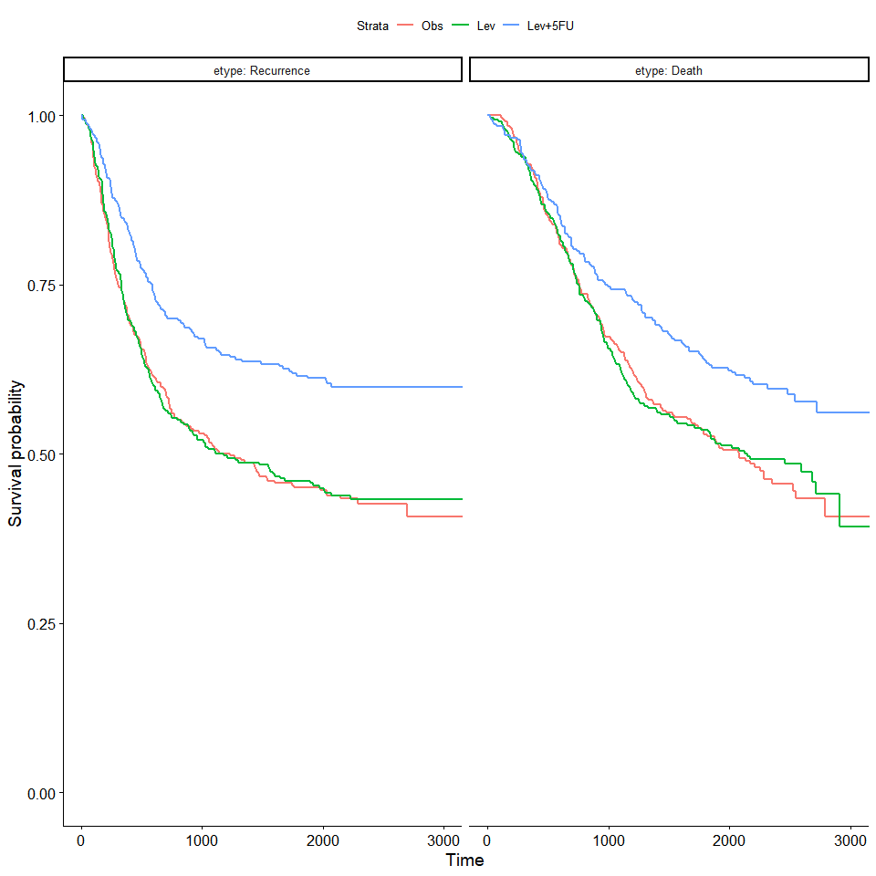

Notice, though, that with this method, we cannot automatically add risk tables below each panel. To do this, we have to manually create and combine the plots. Using the `arrange_ggsurvplots()` function helps, but there's no easy way to customize the plots after the fact. Notice also, that there are duplicated legends and axis titles that make the plot look cluttered.


```r
fit_recurrence <- survfit(Surv(time, status) ~ rx, data = df %>% filter(etype == "Recurrence"))
fit_death <- survfit(Surv(time, status) ~ rx, data = df %>% filter(etype == "Death"))

plot_recurrence <- ggsurvplot(fit_recurrence, censor = FALSE, risk.table = TRUE)
plot_death <- ggsurvplot(fit_death, censor = FALSE, risk.table = TRUE)

arrange_ggsurvplots(x = list(plot_recurrence, plot_death), nrow = 1)
```

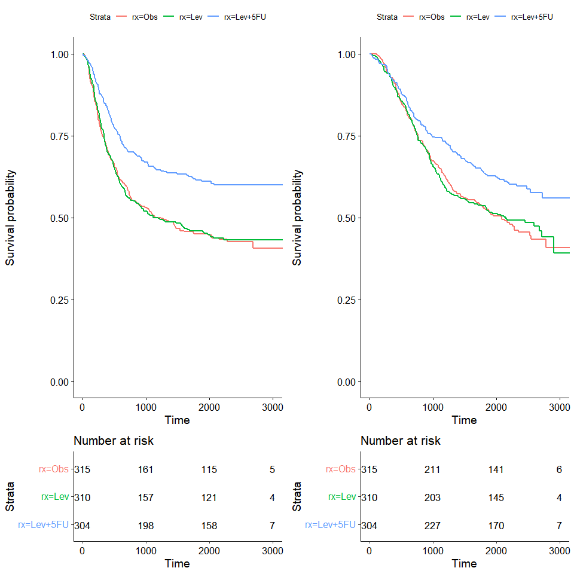

We can also arrange the plots manually using other packages like `patchwork` or `cowplot`. Each can roughly replicate `arrange_ggsurvplots` but we still have issues with customization and clutter.


```r
library(patchwork)
plot_death$plot + 
  plot_recurrence$plot + 
  plot_death$table + 
  plot_recurrence$table + 
  plot_layout(nrow = 2, ncol = 2, guides = "collect", heights = c(0.7, 0.3)) & 
  theme(legend.position = "bottom")
```

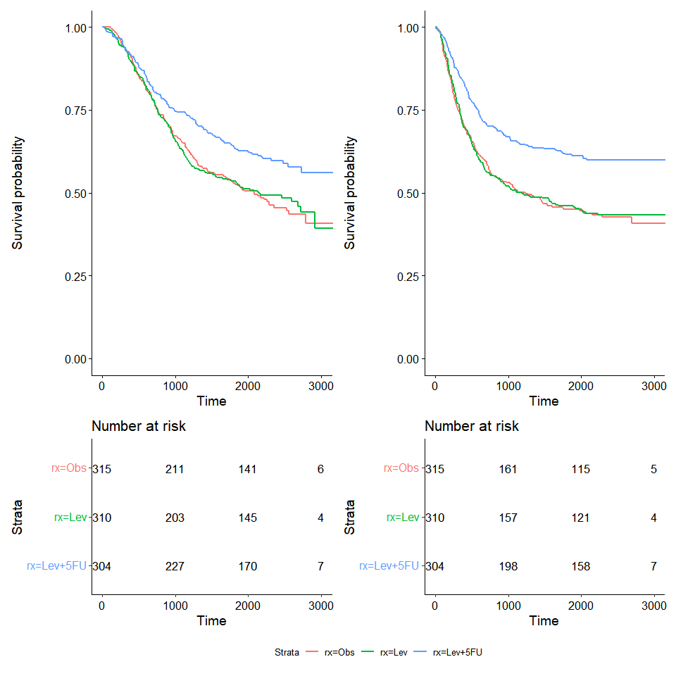


```r
library(cowplot)
plot_grid(
  plot_death$plot,
  plot_recurrence$plot,
  plot_death$table,
  plot_recurrence$table,
  align = "hv", 
  axis = "lr",
  rel_heights = c(0.7, 0.3)
)
```

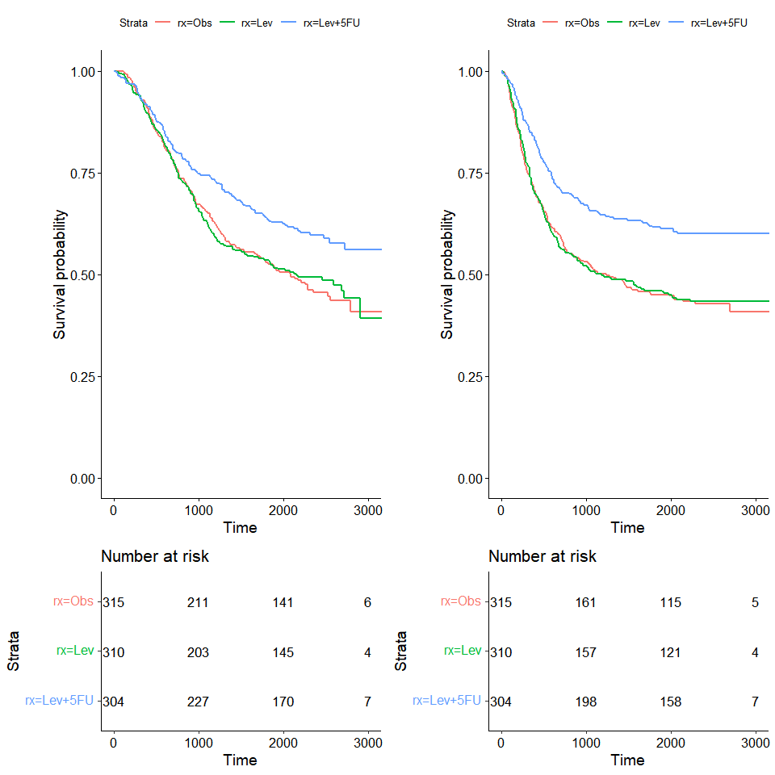

**ggtte** aims to solve these issues. 

# Usage

**ggtte** is simple to use if you are familiar with **ggplot2**. The `geom_km()` function calculates and plots Kaplan-Meier curves, requiring the `x` and `status` aesthetics (typically for the time and event status, respectively). The `geom_risktable()` function adds a risk table, requiring a `y` aesthetic, which will typically be the grouping variable of interest:


```r
library(ggtte)

ggtte_plot <- ggplot(
  data = df %>% filter(etype == "Death"), 
  aes(x = time, status = status, colour = rx)
  ) +
  geom_km(na.rm = TRUE) + 
  geom_risktable(aes(y = rx), na.rm = TRUE) +
  labs(x = "Time (Days)", y = "Survival") 
```

Because the y-axis for the survival curve panel is continuous and the y-axis for the risk table is discrete, we have to specify these explicitly, using the `scale_y_continuous()` function for the survival curves and the special `scale_tte_y_discrete()` function for the risk table.


```r

ggtte_plot <- ggtte_plot + 
  scale_y_continuous(labels = scales::label_percent()) + # use percent labels
  scale_tte_y_discrete()

ggtte_plot
```

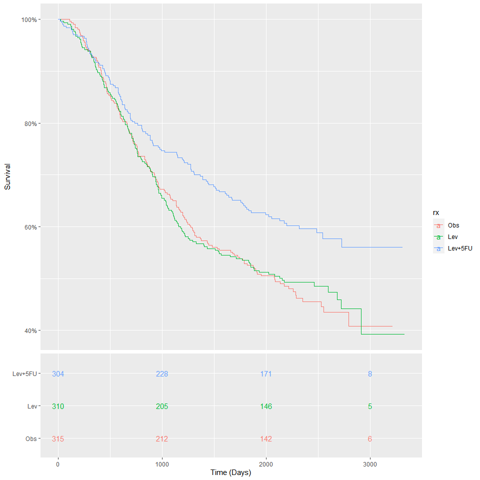

We can also create multiple panel plots easily while preserving the risk tables using **ggplot2**'s faceting functions, `facet_wrap()` and `facet_grid()`.


```r
ggtte_plot %+% 
  df + # update dataset for plots
  facet_wrap(vars(etype), nrow = 1)
```

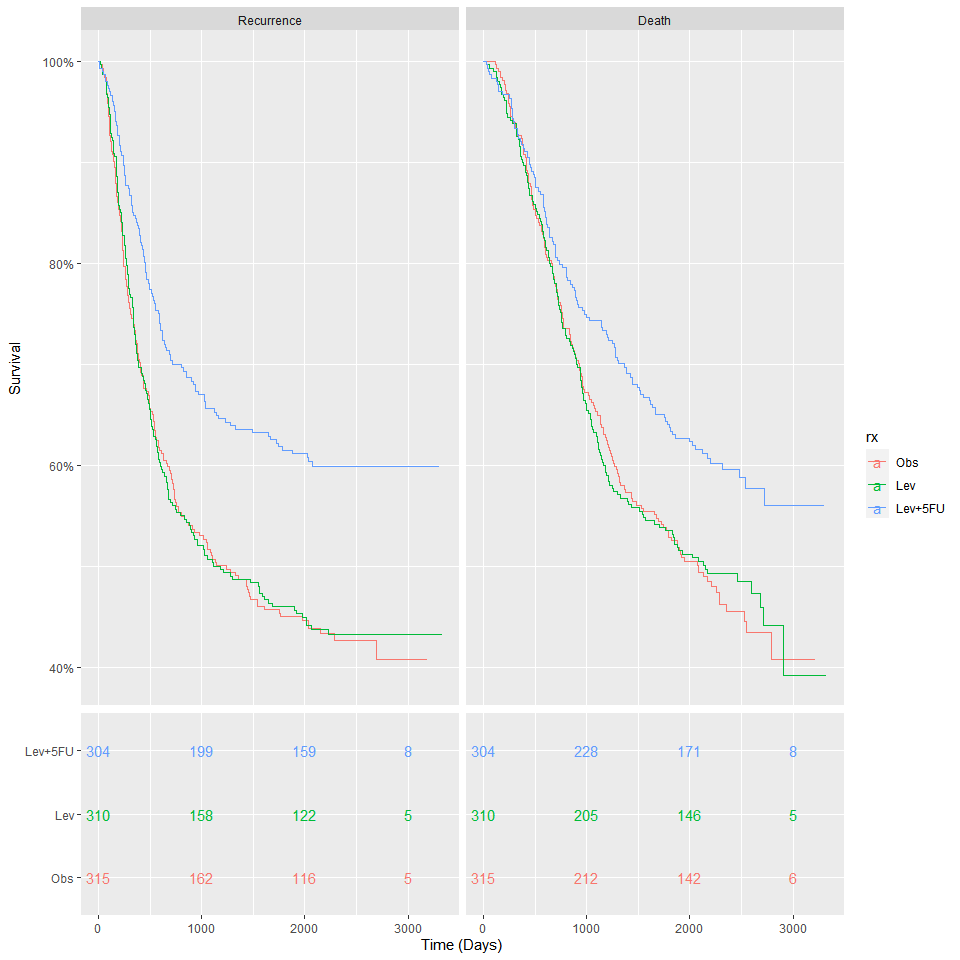


```r
ggtte_plot %+% 
  df + # update dataset for plots
  facet_grid(cols = vars(etype))
```


And we can facet by multiple variables:


```r
ggtte_plot %+% 
  df + # update dataset for plots
  facet_grid(cols = vars(etype), rows = vars(sex))
```

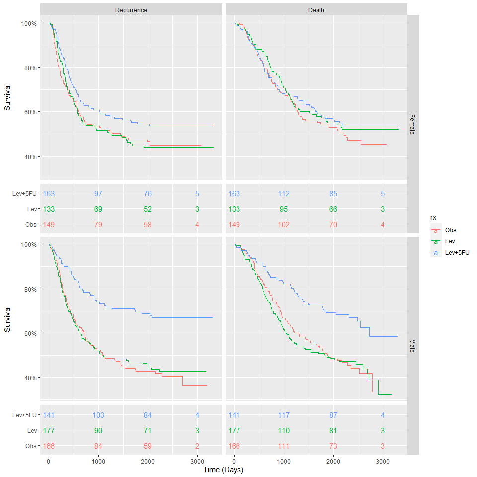

Updating the theme of plots is also easy:


```r
theme_custom <- theme(
  panel.background = element_rect(fill = NA),
  panel.border = element_rect(color = "black", fill = NA),
  panel.grid.major.y = element_line(color = "grey92", linetype = "dashed"),
  strip.placement = "outside",
  strip.background = element_rect(fill = NA),
  strip.text = element_text(size = 14),
  legend.position = "bottom", legend.key = element_rect(fill = NA))

ggtte_plot %+% df +  
  facet_grid(cols = vars(etype), rows = vars(sex)) +
  theme_custom
```

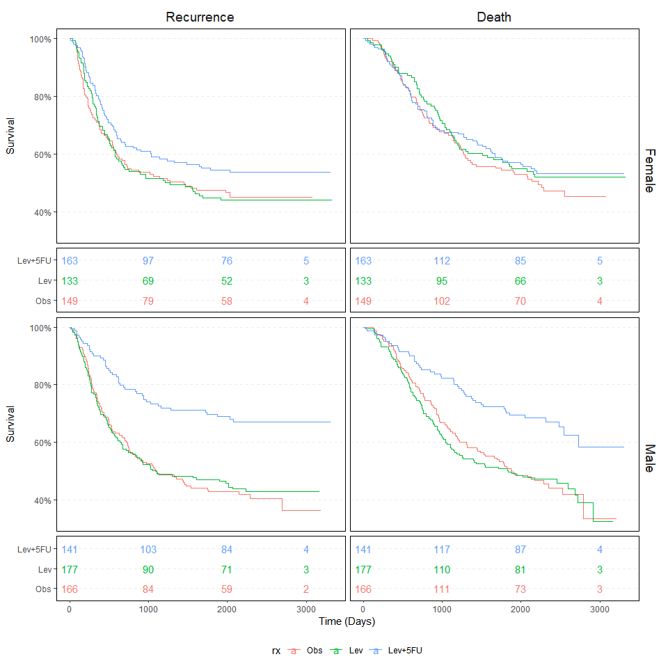

